# MetaWorld-Custom-Multi-Task-Envs

## PPO Configurations

Τα custom-MT experiments χρησιμοποιούν τρία PPO configurations.

| Config     | Role                        | learning_rate   | n_steps   | rollout size (8 envs)   | batch_size   | n_epochs   | mini-batch updates/rollout   | clip_range   | ent_coef   | vf_coef   | max_grad_norm   | net_arch    |
|:-----------|:----------------------------|:----------------|:----------|:------------------------|:-------------|:-----------|:-----------------------------|:-------------|:-----------|:----------|:----------------|:------------|
| `config_1` | Balanced custom-MT baseline | `1e-4`          | `2048`    | `16,384`                | `1024`       | `10`       | `160`                        | `0.15`       | `0.005`    | `0.7`     | `0.5`           | `[256,256]` |
| `config_2` | Conservative/stable         | `3e-5`          | `2048`    | `16,384`                | `1024`       | `15`       | `240`                        | `0.10`       | `0.002`    | `0.8`     | `0.3`           | `[256,256]` |
| `config_3` | Exploration/aggressive      | `2e-4`          | `2048`    | `16,384`                | `1024`       | `10`       | `160`                        | `0.20`       | `0.01`     | `0.5`     | `0.5`           | `[256,256]` |

### Λογική πίσω από τα configurations

#### `config_1` — Balanced custom-MT baseline

Το `config_1` είναι το βασικό custom-MT configuration. Χρησιμοποιεί σχετικά μικρό learning rate, μέτριο clip range και μικρό entropy coefficient. Είναι σχεδιασμένο ως σταθερό baseline για multi-task training.

Σε όλα τα διαθέσιμα αποτελέσματα, το `config_1` είναι το πιο αξιόπιστο configuration συνολικά. Είναι το μόνο configuration που λύνει πλήρως και το δύσκολο pair `basketball_push`.

#### `config_2` — Conservative / stable configuration

Το `config_2` μειώνει το learning rate και το clip range, αυξάνει τα epochs και δίνει μεγαλύτερο βάρος στο value function. Αυτό κάνει τα PPO updates πιο συντηρητικά.

Η λογική είναι ότι σε multi-task training, τα updates μπορεί να είναι πιο noisy επειδή τα rollouts περιέχουν εμπειρία από δύο διαφορετικά tasks. Ένα πιο conservative configuration μπορεί να βοηθήσει τη σταθερότητα. Ωστόσο, σε πιο δύσκολα pairs μπορεί να μάθει πιο αργά ή να αποτύχει στο δυσκολότερο task, όπως φαίνεται στο `basketball_push`.

#### `config_3` — Exploration-oriented / aggressive configuration

Το `config_3` αυξάνει το learning rate, το clip range και το entropy coefficient. Η λογική είναι να δοθεί περισσότερη exploration στην policy.

Τα αποτελέσματα δείχνουν ότι αυτό δεν είναι πάντα θετικό. Σε κάποια object-manipulation pairs μπορεί να πετύχει, αλλά στο `basketball_push` αποτυγχάνει σχεδόν πλήρως στο `basketball-v3` και έχει χαμηλότερη απόδοση στο `push-v3`.

### Γιατί χρησιμοποιείται μεγαλύτερο network

Τα custom-MT configs χρησιμοποιούν:

```text
policy network: [256, 256]
value network:  [256, 256]
```

Η μεγαλύτερη αρχιτεκτονική επιλέγεται επειδή μία κοινή πολιτική πρέπει να μάθει δύο tasks. Σε σχέση με single-task training, το representation που χρειάζεται η policy είναι πιο σύνθετο, επειδή πρέπει να αντιστοιχίσει:

```text
state + task identity -> κατάλληλη action distribution
```

για περισσότερα από ένα tasks.

---

## Results

### Πώς διαβάζονται τα αποτελέσματα

Το βασικό metric είναι το:

```text
mean_success_rate
```

Το success rate είναι το πιο άμεσο κριτήριο, επειδή μετρά αν το task ολοκληρώθηκε επιτυχώς.

Το `mean_return` είναι χρήσιμο για να βλέπουμε την εξέλιξη της μάθησης, αλλά χρειάζεται προσοχή. Επειδή στο evaluation χρησιμοποιείται `terminate_on_success=True`, ένα επιτυχημένο episode μπορεί να τελειώσει νωρίς και να έχει μικρότερο cumulative return από ένα αποτυχημένο episode που συνεχίζει για 500 steps και μαζεύει dense reward. Για αυτό:

```text
success rate = κύριο metric
average return = συμπληρωματικό metric
```

Το `mean_steps` και το `mean_first_success_step` δείχνουν πόσο γρήγορα πετυχαίνει η policy.

### Overall best success pivot

| Pair                   | Config     | `basketball-v3`   | `pick-place-v3`   | Mean over pair   | `push-v3`   |
|:-----------------------|:-----------|:------------------|:------------------|:-----------------|:------------|
| `basketball_pickplace` | `config_1` | `1.00`            | `1.00`            | `1.00`           | nan         |
| `basketball_pickplace` | `config_2` | `1.00`            | `1.00`            | `1.00`           | nan         |
| `basketball_pickplace` | `config_3` | `1.00`            | `1.00`            | `1.00`           | nan         |
| `basketball_push`      | `config_1` | `1.00`            | nan               | `1.00`           | `1.00`      |
| `basketball_push`      | `config_2` | `0.00`            | nan               | `0.50`           | `1.00`      |
| `basketball_push`      | `config_3` | `0.02`            | nan               | `0.42`           | `0.82`      |
| `pickplace_push`       | `config_1` | nan               | `1.00`            | `1.00`           | `1.00`      |
| `pickplace_push`       | `config_2` | nan               | `1.00`            | `1.00`           | `1.00`      |
| `pickplace_push`       | `config_3` | nan               | `1.00`            | `1.00`           | `1.00`      |

---

## Basketball + Pick-Place

Pair id:

```text
basketball_pickplace
```

Tasks:

```text
basketball-v3 + pick-place-v3
```

Training horizon:

```text
5M timesteps
```

### Best success pivot

| Config     | `basketball-v3`   | `pick-place-v3`   |
|:-----------|:------------------|:------------------|
| `config_1` | `1.00`            | `1.00`            |
| `config_2` | `1.00`            | `1.00`            |
| `config_3` | `1.00`            | `1.00`            |

### Best checkpoint per config and environment

| Config     | Environment     | Best checkpoint   | Success rate   | Average return   | Mean steps   | First success step   | Eval episodes   |
|:-----------|:----------------|:------------------|:---------------|:-----------------|:-------------|:---------------------|:----------------|
| `config_1` | `basketball-v3` | `4.20M`           | `1.00`         | `170.98`         | `66.72`      | `66.72`              | `50`            |
| `config_1` | `pick-place-v3` | `3M`              | `1.00`         | `89.62`          | `48.08`      | `48.08`              | `50`            |
| `config_2` | `basketball-v3` | `3.75M`           | `1.00`         | `208.35`         | `68.06`      | `68.06`              | `50`            |
| `config_2` | `pick-place-v3` | `2.20M`           | `1.00`         | `147.47`         | `59.88`      | `59.88`              | `50`            |
| `config_3` | `basketball-v3` | `3.30M`           | `1.00`         | `221.89`         | `70.76`      | `70.76`              | `50`            |
| `config_3` | `pick-place-v3` | `1.50M`           | `1.00`         | `67.24`          | `43.18`      | `43.18`              | `50`            |

### First checkpoint that reached 1.00 success

| Config     | Environment     | First 1.00 checkpoint   | Return at first 1.00   |
|:-----------|:----------------|:------------------------|:-----------------------|
| `config_1` | `basketball-v3` | `3.95M`                 | `168.24`               |
| `config_1` | `pick-place-v3` | `3M`                    | `89.62`                |
| `config_2` | `basketball-v3` | `3.25M`                 | `195.41`               |
| `config_2` | `pick-place-v3` | `2.15M`                 | `117.74`               |
| `config_3` | `basketball-v3` | `2.30M`                 | `143.14`               |
| `config_3` | `pick-place-v3` | `1.50M`                 | `67.24`                |

### Final model results

| Config     | Environment     | Final step   | Final success   | Final return   | Mean steps   |
|:-----------|:----------------|:-------------|:----------------|:---------------|:-------------|
| `config_1` | `basketball-v3` | `5M`         | `0.98`          | `128.44`       | `72.44`      |
| `config_1` | `pick-place-v3` | `5M`         | `1.00`          | `79.30`        | `48.24`      |
| `config_2` | `basketball-v3` | `5M`         | `1.00`          | `164.43`       | `61.44`      |
| `config_2` | `pick-place-v3` | `5M`         | `0.98`          | `72.65`        | `57.22`      |
| `config_3` | `basketball-v3` | `5M`         | `0.68`          | `112.29`       | `206.04`     |
| `config_3` | `pick-place-v3` | `5M`         | `0.88`          | `51.99`        | `109.24`     |

### Learning curves

#### `config_1`

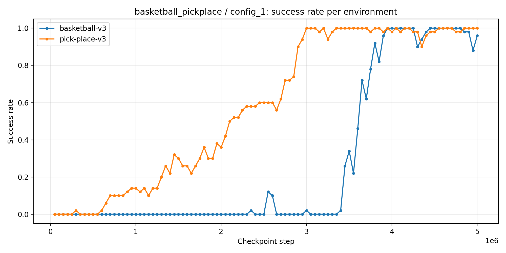

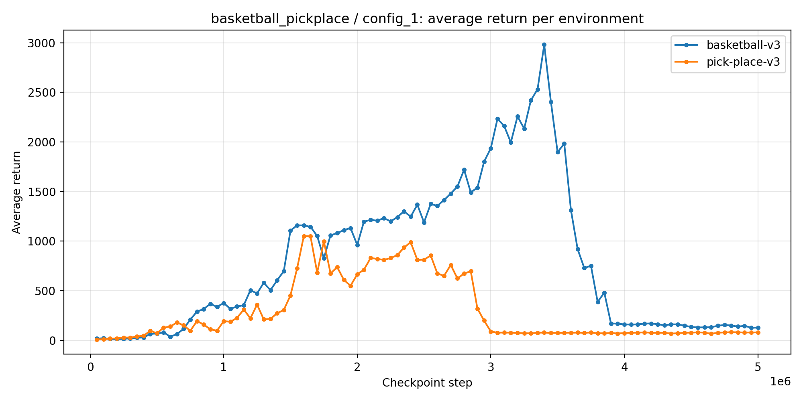

#### `config_2`

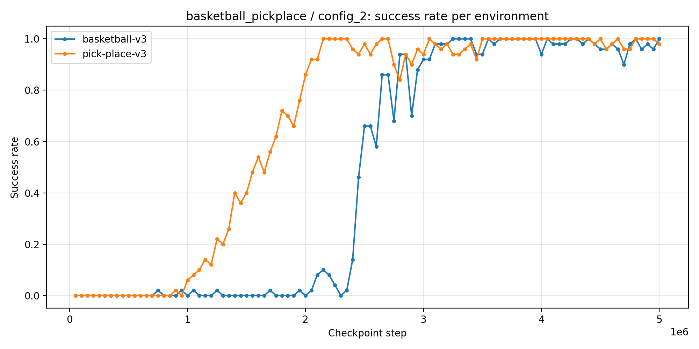

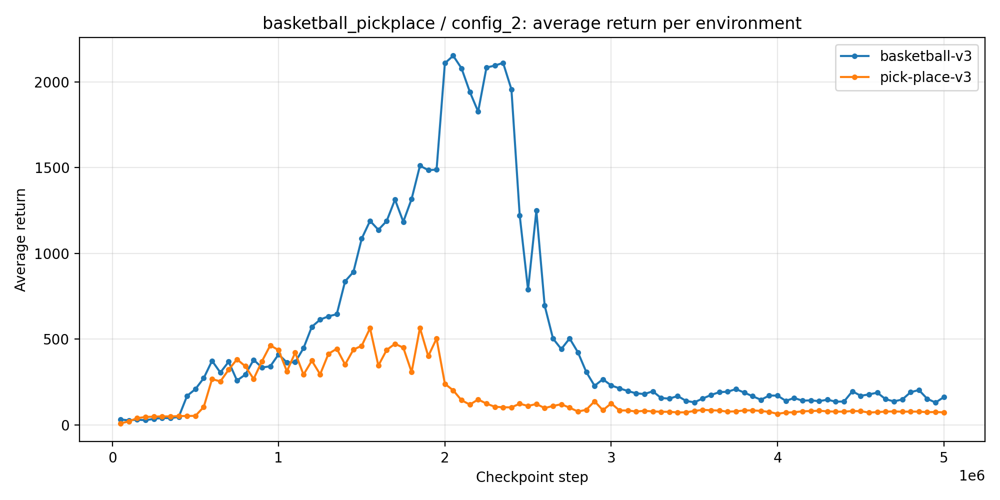

#### `config_3`

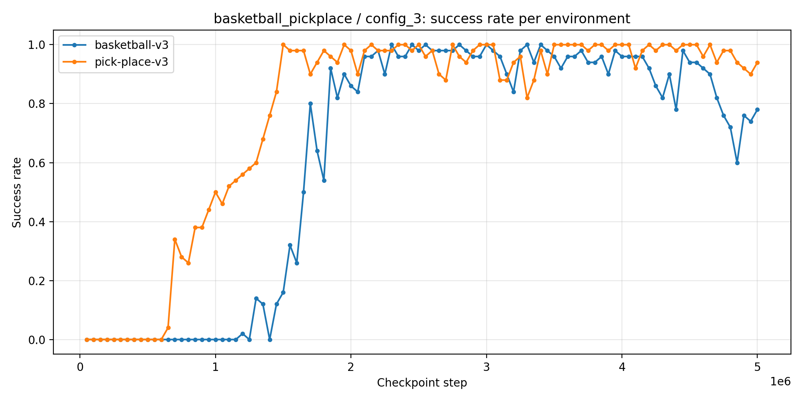

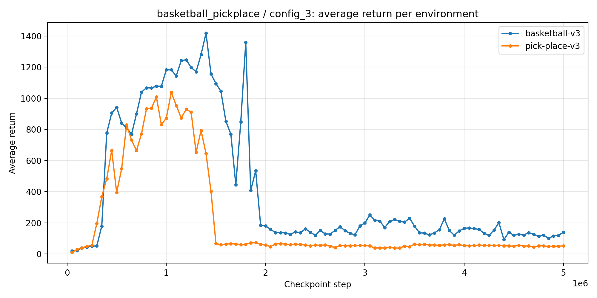


### Συμπέρασμα

Το `basketball_pickplace` είναι πολύ δυνατό αποτέλεσμα. Και τα τρία PPO configurations φτάνουν σε `1.00` success rate και στα δύο environments σε κάποιο checkpoint.

Το `pick-place-v3` μαθαίνεται γενικά νωρίτερα από το `basketball-v3`. Στο `config_3`, το `pick-place-v3` φτάνει σε τέλεια επιτυχία ήδη στο `1.5M`, ενώ το `basketball-v3` φτάνει σε τέλεια επιτυχία στο `2.3M`. Αυτό δείχνει ότι το shared policy μπορεί να μάθει και τα δύο tasks, αλλά ο ρυθμός μάθησης διαφέρει ανά task.

Τα final results δείχνουν επίσης γιατί χρειάζεται checkpoint-based evaluation. Για παράδειγμα, το `config_3` φτάνει σε τέλεια επιτυχία σε προηγούμενα checkpoints, αλλά στο final model η απόδοση πέφτει σε `0.68` για `basketball-v3` και `0.88` για `pick-place-v3`. Άρα το final model δεν είναι πάντα το καλύτερο checkpoint.

---

## Basketball + Push

Pair id:

```text
basketball_push
```

Tasks:

```text
basketball-v3 + push-v3
```

Training horizon:

```text
10M timesteps
```

### Best success pivot

| Config     | `basketball-v3`   | `push-v3`   |
|:-----------|:------------------|:------------|
| `config_1` | `1.00`            | `1.00`      |
| `config_2` | `0.00`            | `1.00`      |
| `config_3` | `0.02`            | `0.82`      |

### Best checkpoint per config and environment

| Config     | Environment     | Best checkpoint   | Success rate   | Average return   | Mean steps   | First success step   | Eval episodes   |
|:-----------|:----------------|:------------------|:---------------|:-----------------|:-------------|:---------------------|:----------------|
| `config_1` | `basketball-v3` | `7.20M`           | `1.00`         | `162.56`         | `63.28`      | `63.28`              | `50`            |
| `config_1` | `push-v3`       | `3.30M`           | `1.00`         | `249.55`         | `52.58`      | `52.58`              | `50`            |
| `config_2` | `basketball-v3` | `9.10M`           | `0.00`         | `828.30`         | `500.00`     | `-`                  | `50`            |
| `config_2` | `push-v3`       | `4.85M`           | `1.00`         | `234.33`         | `49.96`      | `49.96`              | `50`            |
| `config_3` | `basketball-v3` | `8.70M`           | `0.02`         | `274.02`         | `492.44`     | `122.00`             | `50`            |
| `config_3` | `push-v3`       | `1.80M`           | `0.82`         | `66.59`          | `142.76`     | `64.34`              | `50`            |

### First checkpoint that reached 1.00 success

| Config     | Environment     | First 1.00 checkpoint   | Return at first 1.00      |
|:-----------|:----------------|:------------------------|:--------------------------|
| `config_1` | `basketball-v3` | `7.15M`                 | `157.06`                  |
| `config_1` | `push-v3`       | `2.80M`                 | `179.16`                  |
| `config_2` | `basketball-v3` | not reached             | best SR `0.00` at `50k`   |
| `config_2` | `push-v3`       | `4.70M`                 | `186.46`                  |
| `config_3` | `basketball-v3` | not reached             | best SR `0.02` at `8.70M` |
| `config_3` | `push-v3`       | not reached             | best SR `0.82` at `1.80M` |

### Final model results

| Config     | Environment     | Final step   | Final success   | Final return   | Mean steps   |
|:-----------|:----------------|:-------------|:----------------|:---------------|:-------------|
| `config_1` | `basketball-v3` | `10M`        | `0.96`          | `131.17`       | `72.06`      |
| `config_1` | `push-v3`       | `10M`        | `0.98`          | `161.13`       | `51.00`      |
| `config_2` | `basketball-v3` | `10M`        | `0.00`          | `828.48`       | `500.00`     |
| `config_2` | `push-v3`       | `10M`        | `1.00`          | `158.60`       | `39.96`      |
| `config_3` | `basketball-v3` | `10M`        | `0.00`          | `550.91`       | `500.00`     |
| `config_3` | `push-v3`       | `10M`        | `0.74`          | `78.71`        | `177.62`     |

### Learning curves

#### `config_1`

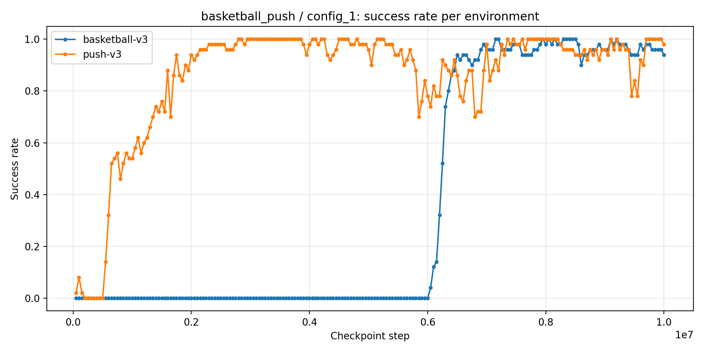

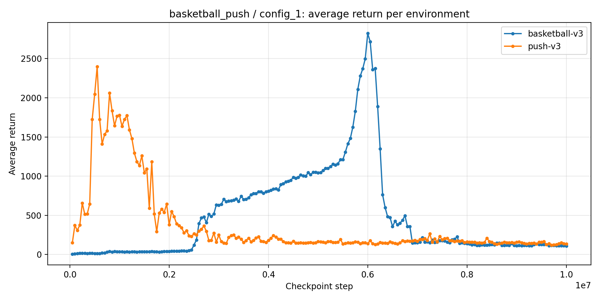

#### `config_2`

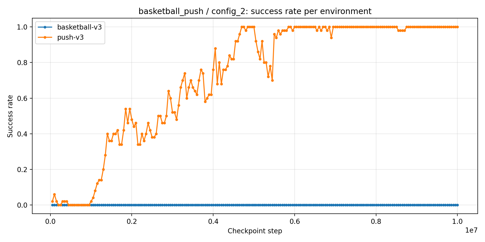

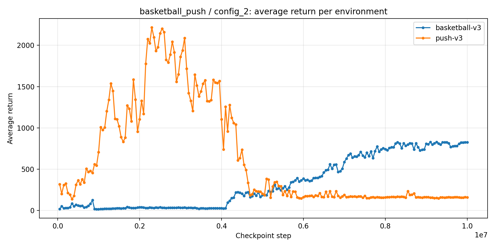

#### `config_3`

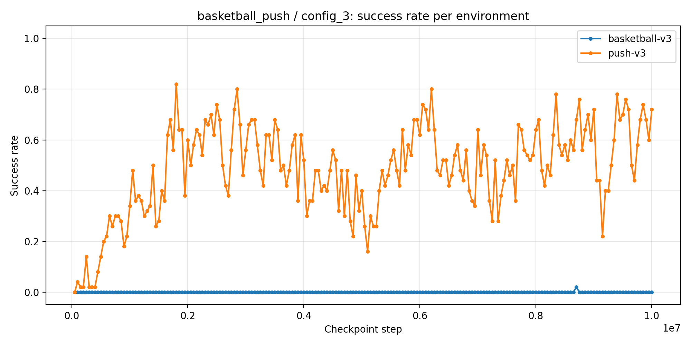

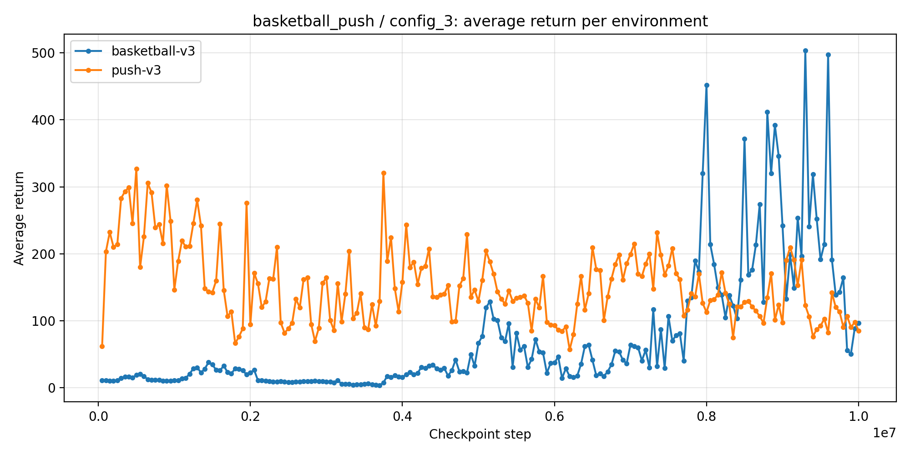


### Interpretation

Το `basketball_push` είναι το πιο ενδιαφέρον pair από πλευράς δυσκολίας, επειδή συνδυάζει ένα αρκετά δύσκολο/unstable task (`basketball-v3`) με ένα task που συνήθως μαθαίνεται πιο εύκολα (`push-v3`).

Το `config_1` είναι το μόνο configuration που λύνει πλήρως και τα δύο tasks:

```text
basketball-v3 = 1.00
push-v3       = 1.00
```

Το `push-v3` φτάνει σε τέλεια επιτυχία νωρίτερα, στο περίπου `2.8M`, ενώ το `basketball-v3` χρειάζεται πολύ περισσότερο training και φτάνει σε τέλεια επιτυχία περίπου στο `7.15M`. Αυτό δείχνει ότι η κοινή πολιτική μαθαίνει πρώτα το ευκολότερο task και χρειάζεται περισσότερο χρόνο για το δυσκολότερο.

Το `config_2` λύνει πλήρως το `push-v3`, αλλά δεν μαθαίνει καθόλου το `basketball-v3`. Αυτό δείχνει ότι το conservative PPO setup δεν είναι αρκετό για το δυσκολότερο task σε αυτό το pair.

Το `config_3` αποτυγχάνει σχεδόν πλήρως στο `basketball-v3` και πετυχαίνει μόνο μερική απόδοση στο `push-v3`. Αυτό δείχνει ότι περισσότερο entropy/exploration δεν οδηγεί απαραίτητα σε καλύτερη multi-task απόδοση.

---

## How to Run New Experiments

### Train one config

```bash
python scripts/training/train_custom_mt_pair.py --pair basketball_push --combo config_1 --timesteps 10000000 --horizon-label 10m --n-envs 8 --device cpu --start-method spawn
```

### Train all configs manually

```bash
python scripts/training/train_custom_mt_pair.py --pair basketball_push --combo config_1 --timesteps 10000000 --horizon-label 10m --n-envs 8 --device cpu --start-method spawn
python scripts/training/train_custom_mt_pair.py --pair basketball_push --combo config_2 --timesteps 10000000 --horizon-label 10m --n-envs 8 --device cpu --start-method spawn
python scripts/training/train_custom_mt_pair.py --pair basketball_push --combo config_3 --timesteps 10000000 --horizon-label 10m --n-envs 8 --device cpu --start-method spawn
```

### Evaluate all configs

```bash
python scripts/evaluation/evaluate_custom_mt_pair.py --pair basketball_push --horizon-label 10m --include-final
```

### Evaluate only one config

```bash
python scripts/evaluation/evaluate_custom_mt_pair.py --pair basketball_push --configs config_1 --horizon-label 10m --include-final
```

### Evaluate with more seeds

```bash
python scripts/evaluation/evaluate_custom_mt_pair.py --pair basketball_push --configs config_1 --horizon-label 10m --eval-seeds 67,68,69 --include-final
```

### Evaluate only selected checkpoints

```bash
python scripts/evaluation/evaluate_custom_mt_pair.py --pair basketball_push --configs config_1 --horizon-label 10m --exact-checkpoints 3300000,7200000,10000000 --include-final
```

---

## How to Add a New Custom-MT Pair

Για να προστεθεί νέο pair, πρέπει να ενημερωθούν τα config files.

Παράδειγμα για:

```text
pick-place-v3 + push-v3
```

προσθήκη στο `PAIRS` dictionary:

```python
"pickplace_push": PairConfig(
    pair_id="pickplace_push",
    task_names=("pick-place-v3", "push-v3"),
    default_total_timesteps=10_000_000,
    horizon_label="10m",
),
```

Αυτό πρέπει να υπάρχει και στο:

```text
scripts/training/custom_mt_config.py
scripts/evaluation/custom_mt_config.py
```

Μετά μπορεί να τρέξει:

```bash
python scripts/training/train_custom_mt_pair.py --pair pickplace_push --combo config_1 --timesteps 10000000 --horizon-label 10m --n-envs 8 --device cpu --start-method spawn
```

και:

```bash
python scripts/evaluation/evaluate_custom_mt_pair.py --pair pickplace_push --horizon-label 10m --include-final
```
